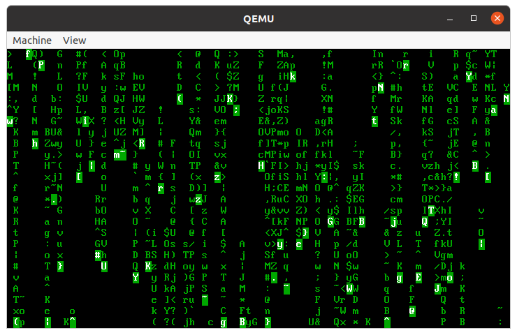

<div align='center'>
    <font size='6'>实验三 MBR与保护模式</font>
</div>

<div align='center'>
    <font size='4'>谷建华</font>
</div>

<div align='center'>
    <font size='4'>2023-10-08 v0.4</font>
</div>

### 实验目的

1. 学习MBR和磁盘分区.
2. 学习x86保护模式编程,以及如何从实模式进入到保护模式.
3. 学习汇编与C之间的相互调用.

### 实验预习内容

1. MBR分区格式.
2. 保护模式之前需要做的准备工作.
3. 应用程序二进制接口.

### 实验内容以及步骤

1. 制作MBR格式的分区硬盘, 编写MBR引导程序, 解析分区表.
   1. 新建一个空的磁盘映像, 并使用fdisk/cfdisk工具进行分区, 然后使用`losetup`和`mkfs`工具将这些分区格式化为对应的格式.  完成后, 你可以使用`fdisk -l test.img`来查看你的磁盘分区情况. 
      **注意, 由于要提供统一的代码框架和实验任务, 请运行`generate_image.sh`脚本来完成这个任务**, 建议打开脚本来学习一下这是如何完成的.
   2. 编译MBR程序`mbr.asm`, 使用`dd`命令将它写入磁盘.  这一步已经被集成到了Makefile中, 直接运行`make`, 验证MBR程序被加载运行. 你应该看到程序打印`FindPart`和`NoPart`.
   3. 修改MBR程序`mbr.asm`, 打印分区表每一项中的`分区类型`和`起始扇区的LBA` 两个属性(一共4个表项, 你只需要打印8个数字即可).
   4. 修改`mbr.asm`程序, 搜索第一个**活动主分区**, 并从该分区加载`boot`启动.
      编译`boot.asm`程序, 将该程序写入到第一个活动主分区的Boot Sector中. 该步骤也被集成到了Makefile中(具体的命令见`install_image.sh`), 你只需要运行`make`观察结果即可. 你应该可以看到`BootFrom`和`NoLoader`.
   5. 修改`boot.asm`, 打印自己所在的是第几个主分区. (提示: 你需要考虑`boot`如何获取这一信息)
   6. 使用分区工具调整磁盘上的第一个活动主分区(即更改分区表上的活动分区标志), 重新尝试上一步, 验证你启动了不同的分区上的`boot`.
      你可以直接修改镜像文件的分区表, 也可以修改`part1.sfdisk`后重新运行`generate_image.sh && make clean`.
   
2. 修改`boot.asm`和`loader.asm`, 获取启动信息, 从分区的磁盘上完成内核启动.
   
   1. 由于分区的出现, `boot`和`loader`无法正常搜索到磁盘上的文件了, 你需要修改`boot.asm` `loader.asm` 以及`boot/inc`目录下的文件, 使得它们能够重新读取`LOADER.BIN`以及`KERNEL.BIN`.
      你修改完成`boot.asm`之后, 应该可以看到输出从`NoLoader`变成`No KERNEL`.
      修改完成`loader.asm`之后, 你应该看到屏幕被清空, 这样就可以继续完成下一个任务点了.
   2. 修改`kernel.asm`,使之能够在虚拟机终端中显示`kernel`字符串(注意,这个时候bios中断**不能**使用了).
   
3. 通过修改`kprintf.asm`,完成kprintf的函数的汇编实现,函数调用的参数如下：
   1. 第0个参数为从终端中的第几个字符开始输出,第0个字符是终端0行0列,第1个字符是0行1列,第80个字符是1行0列,以此类推.
   2. 第1个参数为需要格式化输出的字符串,传进去的参数实际是这个字符串的首地址.
   3. 再之后的参数根据第1个参数的字符串决定,每次调用`kprintf`函数后首先默认输出黑底白字的字符,接下来几条是需要实现的.
      + `%c`在终端输出参数的对应的ASCII字符值（参数保证范围在0~127之间）,在输出字符后输出的位置往下移动一位.
      + `%f`更改之后输出的字符的前景色为参数的对应值(参数保证范围在0~15之间,颜色码对应值)
      + `%b`更改之后输出的字符的背景色为参数的对应值(参数保证范围在0~15之间,颜色码对应值)
      + 其余字符则按照其ASCII码输出（保证字符串不会出现%、换行符、退格符等乱七八糟的字符）,在输出字符后输出的位置往下移动一位.
      + 在`start.c`中存放一组测试样例,效果已经写明可以大家可以用于测试.
   
   4. 在`start.c`中接入`cmatrix.c`中的启动函数`cmatrix_start`,如果编写正确,会在终端中看到以下效果  
	
   
   5. gcc中有编写变长参数函数的工具`__builtin_va_*`,不过在这个实验中,我们并**不需要**你利用这个工具编写`kprintf`,用汇编编写`kprintf`能够帮助你理解`__builtin_va_*`的底层原理.

4. 关于多分区启动的进阶内容
   > **完成说明:** 以下为进阶内容, 你可以选择完成其中的一项或多项, 或者不完成(如果你不感兴趣或者做不完). 这部分内容没有特别详细的步骤说明和目标, 难度也不尽相同, 你可以自己决定完成的程度.
   >
   > **计分说明:** 前面的必做任务完成后会有基础分(占比较大), 选做任务的得分会由你的工作量 功能完成度 代码质量等决定, 并叠加在基础分上. 具体的得分会根据同学们完成情况进行分配.
   1. 扩展分区遍历: 修改MBR程序, 打印所有扩展分区的`起始扇区LBA地址`.
   2. 交互式启动(仅主分区): 你可以将所有的主分区都放上`boot.bin`, 然后通过键盘中断(`INT 16H`)编写交互程序, 让用户选择从哪个主分区启动.
   3. 交互式启动(任意分区): 结合4.1和4.2, 让用户选择从哪个分区上启动(包括扩展分区). 不过经助教尝试, 这似乎无法在有限的446字节内实现. 不过, 我们真的只有一个扇区吗? 你可以联系助教讨论这件事情. 当然, 实用的boot loader不会选择这么做(你可以从这里了解[GRUB的做法](https://0xax.github.io/grub/
)), 这只是为爱好者准备的一个任务目标
   4. 分区表解析工具: 编写一个C语言程序, 可以根据MBR和磁盘内容输出每个分区(包括扩展分区的)分区信息(也就是分区表项). 具体的输出形式可以参考`fdisk -l`的输出.
   5. 切换到FAT32文件系统: 之前硬盘启动盘的文件系统格式为FAT12,这次需要将FAT12格式变成FAT32格式,这需要熟读官方文档,了解FAT32的文件格式以及处理方式. 修改`boot`/`loader`代码实现正确加载.
   6. 使用GRUB完成引导: 前面的任务中, 我们都是手写的引导程序, 但是实际上我们假设了非常理想的情况(例如文件系统只有FAT12,参数固定,启动设备固定等等). 如果换了一种硬件环境, 那重新适配的工作会非常繁琐. 不过已经有人写了GRUB工具, 可以适应多种情况, 代替我们完成前面的`boot`和`loader`的工作, 直接加载内核. 你需要探索如何用GRUB引导我们的内核, 如果你想做这个任务但是不知道如何下手, 请联系助教寻求帮助.

### 实验总结

1. 简要描述加入MBR后的启动流程.
2. 在loader阶段都完成了哪些主要功能？X86系统是如何进入保护模式的？在进入保护模式之前需要完成哪些准备工作？
3. C语言和汇编语言是如何互相调用的？参数如何传递？

### 实验参考

#### 分区引导

在lab1和lab2中实现了boot和loader, 基本上能够从磁盘上加载代码运行了, 不过这和实际情况相差甚远.

如果你认真看Makefile中执行的指令就会发现, 实际上我们所用的持久化设备是一块(虚拟的)软（硬）盘! 这个盘上只有一个文件系统, 也就意味着你只有一个C盘(虽然是个不太恰当的比喻). 这显然是不好的, 这样你就装不了双系统了, 也不能在重装系统的时候保留其他部分的数据. 即使是在20年前, 我们的电脑也有多个磁盘分区. 很容易想到这样的问题: 如何增加多个分区呢? 在增加了多个分区之后, 磁盘上的数据结构必然会发生变化, 又该如何引导系统呢(如果你不理解这个问题, 请回忆一下lab2中boot是如何加载loader的)? 

本实验的目的是为了解分区相关的知识, 并从MBR格式分区的磁盘上引导操作系统. 虽然这种方式也已经逐渐被弃用, 不过它已经比较贴近你的PC/Laptop的实际的启动方式, 说不定你的电脑还能兼容这种方式呢(不过上次在电脑上见到MBR还是我上小学的时候). 补充一下, 现在主流的磁盘分区格式是GPT(GUID based Partition Table, ~~不是Generative Pretrained Transformer~~), 引导方式是UEFI. 如果你感兴趣的话, 可以看看这个人的[科普文章](https://zhuanlan.zhihu.com/p/26098509)

我们的终极目标是在一个多分区的硬盘上实现从不同的可引导分区上加载loader.

文档仓库/群文件中的`硬盘启动与分区`这一份文档会比较有用, 另可参考[osdev/PartitionTable](https://wiki.osdev.org/Partition_Table).

#### 分区与MBR

一块磁盘可以看做是一个巨大的数组(事实上LBA就是提供了这样一种抽象, 我们实验中用的就是LBA来读取磁盘中的某些块数据), 分区就是把它切成很多块, 每块可以单独管理. 那么我们就需要用某种方式来记录这些分区的具体划分(比如每个分区的类型, 分区的开始和结束位置等), MBR(Master Boot Record 主引导记录)就是其中的一种方式. 

在lab2的时候我们初步接触了FAT12文件系统, 也是我们第一个接触的磁盘数据结构. 然后我们会想是不是分区也同样是一个磁盘数据结构? 答案是肯定的. 在我们学FAT12的时候会感觉有点复杂, 什么簇啊, 目录项啊这些东西刚接触的时候可太多太复杂了. 但是实际上MBR这个磁盘数据结构比文件系统数据结构简单多了. 

我们建议在你读到这的时候先"忘记"前两次实验的内容, 如果你对前两次实验的流程印象过深会影响你对MBR的理解. 因为MBR的引导方式与之前的实验的引导方式完全不同. 

我们知道在机器启动的时候, BIOS会将磁盘的第0个扇区加载到0x7c00处, 然后就将执行流移交给了我们的boot. 在前两次实验中我们的boot就马不停蹄地去加载loader了, 一切看上去都非常合理, 好像就应该这么干, 因为我们就一个盘, OS不在里面就怪了. 

但是在引入分区这个概念后就傻眼了, 相当于我们有那么多个盘, 每个盘的第0个扇区的末尾都有0x55aa, 我们哪知道哪个盘是真正存放我们的OS的引导盘? 如果随便选一个运气不好选到错误的盘, 就只能面对着"This is not a bootable disk. Please insert a bootable floppy and press any key to try again"不知所措. 

所以我们大概知道了MBR这个磁盘数据结构所需要实现的功能:

1. 对整个磁盘进行分区, 将磁盘划分成若干个连续段, 每一个连续段都是一个盘, 并记录每个盘的元信息. 
2. 在那么多分区中标记出一个用于引导的分区. 

在引入了MBR后, 磁盘的第0个扇区中的代码就不再是我们之前实验用的boot代码了（而且第0个扇区不会存放任何的文件系统信息）, 而是一段解析MBR数据结构的代码. 在解析完MBR后跳转到引导盘的第0个扇区, 这里存放的就是我们之前lab2使用的boot代码（但是可能需要做稍微的修改）, 再之后就是熟悉的加载loader等一系列操作完成正常的加载. 

#### MBR主分区

讲了那么多MBR的功能, 我们还是对这个磁盘数据结构还是一无所知. 在这个数据结构的设计的开始, 设计师认为最多只需要四个分区就能满足绝大部分的需求了, 所以磁盘的第0个扇区被划分成以下的结构：

| 区间    | 字节数 | 内容                                               |
| ------- | :----: | -------------------------------------------------- |
| 0~445   |  446   | 用户代码, 用于解析MBR数据结构                      |
| 446~509 |   64   | 四个主分区的元信息, 每个元信息占16字节, 又叫分区表 |
| 510~511 |   2    | 0x55AA                                             |

可以看到分区表放在了扇区的末尾, 紧接着就是熟悉的0x55AA. 每个主分区的元信息占16字节, 其中的数据排布如下：

| 区间  | 字节数 | 内容                                               |
| ----- | :----: | -------------------------------------------------- |
| 0~0   |   1    | 分区状态(0x80可引导, 0x00不可引导, 其他数值不合法) |
| 1~1   |   1    | 起始磁头号                                         |
| 2~2   |   1    | 起始扇区号(仅用低6位, 高2位为起始柱面号的8,9位)    |
| 3~3   |   1    | 起始柱面号的0~7位                                  |
| 4~4   |   1    | 分区类型                                           |
| 5~5   |   1    | 结束磁头号                                         |
| 6~6   |   1    | 结束扇区号(仅用低6位, 高2位为结束柱面号的8,9位)    |
| 7~7   |   1    | 结束柱面号的0~7位                                  |
| 8~11  |   4    | 起始扇区的LBA                                      |
| 12~15 |   4    | 分区所占扇区数目                                   |

其中我们只需要关心分区状态、分区类型、起始扇区的LBA和分区所占扇区数目这四项就行, 其余的元信息都是为软盘CHS索引所使用, 我们前两次实验通过硬盘启动, 所以并不需要关心这部分元信息. 

可以看到通过分区状态就能判断这个主分区是否是我们想要的引导分区, 起始扇区的LBA和分区所占扇区数目这两项可以让我们知道这个分区占整个磁盘的哪部分. 

#### MBR扩展分区和逻辑分区

再后来, 人们发现四个主分区好像也不太够用, 但是这个规范已经定下了, 不能再改了, 所以设计师提出了扩展分区这个概念. 扩展分区它占四个主分区中的一项, 它的分区类型为0x5, 而且一个磁盘中最多有一个扩展分区. 

```
000001b0: 0000 0000 0000 0000 2813 4cee 0000 8020  ........(.L.... 
000001c0: 2100 83a8 1a0e 0008 0000 0090 0300 0065  !..............e
000001d0: 0d35 0505 105b 0098 0300 8082 0200 0000  .5...[..........
000001e0: 0000 0000 0000 0000 0000 0000 0000 0000  ................
000001f0: 0000 0000 0000 0000 0000 0000 0000 55aa  ..............U.
```

这是一个分区表信息. 

第一个主分区从0x1be开始, 一直到0x1cd结束, 分区状态为0x80可引导, 分区类型为0x83, 分区开始的扇区LBA为`0x0000_0800`, 一共占`0x0003_9000`个扇区. 

第二个主分区也是同理可以获取元信息, 分区状态为0不可引导, 分区类型为0x5即扩展分区, 分区开始的扇区LBA为`0x0003_9800`, 一共占`0x0002_8280`个扇区. 

扩展分区可以理解为一个容器, 其中能够存放若干个子分区, 即逻辑分区. 这些逻辑分区的组织形式如一个单向链表. 如果用C语言的形式表达, 可以表达成这样：

```c
struct logic_partition{
   void *partition_content;
   struct logic_partition *next_partition;
}
```

首先, 所有的逻辑分区都认为它们所属的扩展分区是一个完整的磁盘, 所以它们所有的LBA寻址是针对当前这个扩展分区的, 就是说无论这个扩展分区多大, 分布在磁盘中的哪块, 所有的逻辑分区的LBA都保持不变. 即它们所对应的LBA的在磁盘中的实际位置得加上这个扩展分区的开始LBA. 

扩展分区的开头第0个扇区并不是第一个逻辑分区所在位置, 而是如之前描述的结构一样存放有一张分区表, 不过名字叫扩展分区表, 扩展分区表只用到了前两项, 第一项描述第一个逻辑分区分布的元信息, 即上面的`partition_content`, 第二项描述是下一个扩展分区表所在位置的元信息, 即上面的`next_partition`. 

可以简单理解为每一个逻辑扇区被一个包含扩展分区表的匿名数据结构（确实不知道叫啥名字）给包装起来, 然后这些匿名数据结构之间通过扩展分区表像单向链表一样连接起来. 

```
073001b0: 0000 0000 0000 0000 0000 0000 0000 00c8  ................
073001c0: 3b0e 830f 3f10 0008 0000 0050 0000 0010  ;...?......P....
073001d0: 0110 0576 2511 0058 0000 0058 0000 0000  ...v%..X...X....
073001e0: 0000 0000 0000 0000 0000 0000 0000 0000  ................
073001f0: 0000 0000 0000 0000 0000 0000 0000 55aa  ..............U.
```

这是一个扩展分区表信息. 

扩展分区表第一项指向的是逻辑分区的实际位置, 即偏移扩展分区的0x800扇区处, 一共有0x5000个扇区. 

扩展分区表第二项指向的是下一个匿名数据结构的实际位置, 即偏移扩展分区的0x5800扇区处, 一共有0x5800扇区（相当于是包含扩展分区表和逻辑分区的整个匿名数据结构大小）

#### MBR分区

至此MBR整个数据结构就讲完了, 不过自己去构造一个MBR非常麻烦, 好在有工具比如cfdisk/fdisk能够帮我们减少处理这部分的时间. 

至于如何分区, 这里给出一种在linux上, 从新建磁盘映像到挂载并复制数据到某个分区的完整过程实例:

```shell
# 新建磁盘文件
dd if=/dev/zero of=a.img bs=512 count=400000
# 使用带有交互式界面的cfdisk进行分区, 初始化选择dos, 不需要详细的说明就会用, 分完记得写入
cfdisk a.img
# 你也可以使用cfdisk的dump功能将分区表导出到part.sfdisk中
# 使用sfdisk将导出的分区表写入磁盘
sfdisk a.img < part.sfdisk
# 使用losetup将磁盘虚拟为块设备, losetup -f是查找一个可用的loop设备号, 这里我们打印出来
dev=`losetup -f`
echo ${dev}
sudo losetup -P ${dev} a.img
# 这时候如果你执行以下命令, 会看到形如 loop{k}p{n}的一串设备, 一般这就是你的a.img映射为设备了
# p{n}的具体含义由你的分区决定, 下面我们假设虚拟出来的是loop0
ls /dev/ | grep loop
# 不幸的是, 似乎没什么好办法自动格式化分区, 你只能一个个去格式化了, 假设我们的设备是loop0
sudo mkfs.vfat -F 32 loop0p1
sudo mkfs.ext2 loop0p4
sudo mkfs.vfat -F 16 loop0p6
# 假设你想往分区3里面塞个文件, 那么挂载它
mkdir -p tmp
sudo mount /dev/loop0p3 ./tmp/
sudo cp loader.bin ./tmp/
sudo umount ./tmp/
# 假设你想往分区1的第一个分区写114个字节
sudo dd if=114byte.txt of=/dev/loop0p1 bs=1 count=114
# 假设你想查看分区1的第2个扇区, 也就是偏移量512(0x200),长度512,每行16字节
sudo xxd -o 0x200 -l 512 -c16 /dev/loop0p1
# 取消设备映射
sudo losetup -d /dev/loop0
```

#### 引导MBR

通过前面的实验, 我们知道了BIOS固件会加载第一个扇区到`0x7c00`, 它可不管0号扇区里面放的是什么. 如果我们的启动盘是FAT12的软盘, 那么它的Boot Sector就会被加载; 如果我们的0号扇区上放的是MBR, 那么BIOS加载的就是MBR里面的引导程序. 在前一种情况下, 我们只有一个选择; 在多分区的情况下, 每个分区都可以在自己的首个扇区上放置引导扇区, 这就是为什么我们能够安装多个操作系统. 为了能够利用这一点, 我们的MBR需要搜寻并加载不同分区自己的引导程序.

一般来说, MBR引导程序(这里称为`mbr_boot`)的主要任务就是解析分区表, 然后寻找活动主分区, 再加载这种分区的Boot Sector(通常就是分区的第一个扇区), 这里称为`os_boot`. 再由`os_boot`负责加载loader. 总结一下, 我们的新的引导过程分为三步: `mbr_boot` -> `os_boot` -> `loader`; 而原来的引导过程则是两步: `os_boot` -> `loader`.

如果你希望了解更加实际的启动流程, [这篇文章](https://neosmart.net/wiki/mbr-boot-process/)讲的很好.

通常情况下, `os_boot`和`loader`是一起设计编写的, 这两者之间的调用完全可以硬编码很多东西(事实上他们是同一个程序的两个部分); 然而, `mbr_boot`和`os_boot`之间往往是由不同的人员编写的, 因此需要一些约定来让他们协同工作. 可惜的是, 这似乎没有一个标准文档, 下面列出的只是从网络上找到的几点约定:

- 一般而言, `os_boot`也会认为自己从`0x7c00`开始运行, 因此`mbr_boot`需要将`os_boot`也放到`0x7c00`的位置, 你需要考虑一下这里会出现的问题.
- 为了读取所在分区上的数据, `os_boot`需要知道分区的起始块号(因为分区的文件系统中不包含起始地址数据, 不信的话你可以多查阅一些文件系统的手册). 你肯定不会希望重新加载一次MBR, 通行的做法是在跳转到`os_boot`的时候将`DS:SI`指向`os_boot`所在的分区表项. 
- `DL`寄存器应该保存为当前启动的驱动器号, 一般而言是`0x80`(硬盘)或者`0x00`(软盘), 这个值一般而言会由BIOS在加载MBR的时候同样放在`DL`中

你在做实验的过程中, 还需要考虑一个问题, 就是如何正确的把你的程序写入到磁盘里面. 因为分区格式化程序会预置一些数据到Boot Sector里面, 你如果不小心覆盖了就很不妙了. 这个问题分为两个方面: 一方面是你的编译结果不应该再是512字节了, 你需要按照要求重新设置你的程序大小, 这可以通过调整最后的0填充数量来完成; 另一个方面是, 你需要精确地将你的程序写入到合适的位置,下面这个命令可能会给你一些启发(数据是乱编的, 请自己探索如何使用`dd`命令):

```shell
dd if=boot.bin of=/dev/loop0p2 seek=114 skip=514 bs=1919 count=810
# 将boot.bin中从515字节开始的1919*810个字节的数据写入到/dev/loop0p2的从115字节开始的位置
```

#### 进入保护模式

在进入了loader后,终于可以不受512字节的代码限制.进入loader之后我们需要干的一件事是：**进入保护模式**.

为什么要进入保护模式？这个时候这个问题就自然而然问出来了,这不是实模式待着好好地嘛,去啥保护模式.正常情况是这样的,对于我们写的程序来说实模式貌似挺够我们用的,但是如果稍微写个大一点的程序呢？这个时候一个噩梦般的事情发生了：段偏移的寻址方式太弱了,虽说1MB的寻址能力挺强的,但是对于一个固定段,它的偏移寻址能力只有64KB大,只需要128个boot程序般大的程序文件会超过偏移寻址能力,这对程序员来说是极为头疼的,写程序逻辑本身就很麻烦了,还要关心寻址,这程序谁爱写谁写.

而保护模式解决了这个寻址问题,它扩展了段偏移寻址模式的定义,将偏移范围支持到4GB大,刚好是一个int能够表达的范围,这不爽死XD,所以进入保护模式还是很有必要的.

保护模式是怎么扩展段偏移寻址模式的定义？这帮硬件工程师商量来商量去最后给出了一种方式`gdt(global descriptor table)`全局描述符.全局描述符抽象来看是一个数据结构,这个数据结构不能说是整齐规整,也可以说是东拼西凑,具体可以到Orange教科书中查询相关的数据结构细节.与实模式的段地址不同,保护模式的“段地址”就是gdt的基地址,而gdt能够表示偏移寻址的范围最多能到4GB,这样就能够支持4GB的寻址.

回忆实模式,它的基址是一个地址值,很容易用一个寄存器进行存储,但是保护模式的段地址是一个数据结构的基地址,而且由于段寄存器的历史遗留问题仍然只有16位,不能填入32位数据,所以硬件工程师就搞出一条命令`lgdt`,由于我们在一个固定缓冲区按顺序存储一些gdt,亦叫gdt表（数组）,只需要通过`lgdt`指令告诉硬件gdt表的起始地址和长度就能让硬件提前分析gdt表,这样我们只需要将段寄存器改成gdt相对于gdt表的偏移量（亦称选择子）就可以轻松表示.（改成这种方式还能够控制权限,不过本篇不谈）

在进入保护模式之前,根据硬件厂商的手册,我们需要做三件事

1. 加载gdt表
2. 打开地址线A20
3. cr0第0位置位

这三件事做完之后,通过一个32位长指令的长跳转跳转到`SelectorFlatC:LABEL_PM_START`后,我们执行环境从16位变成了32位,从实模式跳到了保护模式.其中`SelectorFlatC`是希望cs变成的gdt选择子,`LABEL_PM_START`是指希望跳到的地址（不受段偏移限制了）.

在进入了保护模式后,就可以忘掉落后的段偏移访存方式了,能够更加舒服地写汇编程序了.但惊喜不止于此,我们还能够通过C语言实现我们想要的功能,想必看完那么多汇编大家肯定不想再读汇编了,苦日子终于熬到头了,可以用C了,C比汇编可好读太多了.

#### 汇编与C之间的交互

在进入了C语言的部分之后就需要面临一个问题,如何进行汇编与C之间的交互？这个问题放平时可能想都不会想,大一开始的C语言课程可能根本不会让你意识到程序背后本质可以抽象成一条条汇编指令的执行,就如大家写的汇编程序一样,所以C语言代码本身可以具象为汇编代码,C语言中的函数本身就是一条label标签,这样就可以通过jmp和call进行函数跳转/调用将执行流交给C语言程序.

但是这么说依然很抽象,你依然会很难理解一个在C语言中的函数调用具体发生了什么,一个带参数的函数跳转是怎么执行的,中间经历了什么？

1. 导入/导出符号

如何让汇编代码与C代码进行相互调用,首先需要了解什么是符号,符号说人话就是函数名,全局变量名等.我们在编写汇编代码的时候会写一些标签,这些标签成了我们跳转的目标,也可以成为我们访存的目标,从某种意义上,符号就是这些标签.

先解决第一个问题,如何在汇编中调用C函数/全局变量,对于汇编来说,这个符号是外部的,所以需要引入这个符号,引入到代码中,这样编译器就知道这个就是外部的符号,在跳转/访存的时候就知道这个符号是从哪里来的了.虽然在汇编文件编译的时候不知道确切地址,在链接的时候就能够知道了.

```c
;nasm汇编程序
extern foo ; 这个时候通过引入foo符号实现函数的跳转
call foo   ; 通过调用foo函数实现打印

//C程序
#include<stdio.h>
void foo()
{
    printf("114514 1919810");
}
```

然后解决第二个问题,如何在C中调用汇编中的函数/全局变量,对于汇编来说,这个符号不仅是汇编文件用,外部也要用,所以汇编文件就需要将符号导出,告诉外界,它们想要的符号在汇编文件里,这样在链接的时候其他文件也知道这个符号在哪.

```c
;nasm汇编程序
global foo ; 导出foo符号
foo:
    ...    ; 这里是foo函数的实现

global foofoo ; 导出foofoo符号
foofoo dd 0 ; 这个是个全局变量

//C程序
void foo(); //这里类似汇编里面的extern,如果下面没有foo函数的实现就将foo这个函数的符号导入进来
extern int foofoo; //将foofoo这个全局符号导入进来

void bar()
{
    foo(); //这样就能够调用foo函数
    foofoo=1;//这样就能够使用foofoo变量
}
```

这样汇编与C语言代码之间的相互调用就完成了.如果你好奇原理是什么,可以看第3节符号表.

2. 参数传递 

刚才解决的是C语言函数与汇编函数相互调用的问题,但是假设有这么个情况,这个C语言函数是一个带输入参数的函数,比如`int foo(int a, int b)`,这个时候如果光调用`call`指令可不好使,`a,b`参数就被吞了,下面的`foo`函数拿着混乱的参数大搞破坏,这肯定是我们所不希望的.

那么对于`foo`函数,它还有两个参数`a,b`,那么如何将`a,b`“告诉”子函数,对于i386指令集规定了参数传递方式：对于所有参数,按照从右往左的顺序压栈,通过栈传递中间参数.

对于上面这个例子来说,nasm汇编在调用C函数之前需要先将`b`压栈,然后将`a`压栈,最后才是调用`call`指令跳转到`foo`函数的标签处,C函数同样遵循这个规范,所以会去栈里寻找`a,b`两个变量的值,离栈顶越近的元素在函数定义的时候参数越靠左.

这种从右往左的压栈方式其实很好,比如`printf`,我们不知道要输入多少个参数,但是会根据其中的字符串中的信息`%d,%s`判断需要多少个参数,然后在栈中找就可以将传入的参数拿出.在这次的实验中大家需要实现一个类似`printf`的函数,来深刻理解这种传参方式.

通过压栈就能解决参数传递的问题,这种传递方式本质叫**应用程序二进制接口**,在第4节中有介绍.

3. 符号表

可能大家都忘完了大一学的大计基和C程序,这个时候就要需要回忆一下一个C语言程序的编译过程`预处理、编译、汇编、链接`.相信大家在大一的时候把这一过程当文科一样背,现在可能基本记不清这几步具体发生了什么.前面三个步骤还能勉强理解理解,这个链接可能是真的难以理解.

假设有若干个可重定位文件(.o文件),那么可以使用GNU的工具`ld`对这些可重定位文件进行链接成一个可执行文件.

```c
//1.c程序内容
void foo()
{
    int bar=114514;
}
int main()
{
    foo();
}
//2.c程序内容
void foo()
{
    int bar=1919810;
}
```

将两个程序的内容用gcc(附上-c参数)命令编译成两个可重定位文件,然后尝试将两个可重定位文件用ld命令链接,然后你就会发现一个神奇的现象.

```shell
$ gcc -c 1.c && gcc -c 2.c
$ ld 1.o 2.o -o test
ld: 2.o: in function `foo':
2.c:(.text+0x0): multiple definition of `foo'; 1.o:1.c:(.text+0x0): first defined here
ld: warning: cannot find entry symbol _start; defaulting to 0000000000401000
```

你会发现不让你链接,原因是foo被两次定义了.那么原因是什么？它凭什么知道foo被两次定义了？我们作为写程序的人肯定知道被两次定义了,但是机器怎么知道？这就涉及到**符号表**了.

每一个可重定位文件里面存放着一张符号表,它存放所有符号信息.那么如何获取符号信息？GNU里面有一个工具`nm`能够获取对应的符号信息.

```shell
$ nm 1.o
0000000000000000 T foo
0000000000000012 T main
$ nm 2.o
0000000000000000 T foo
```

看到这个的时候,哦,确实有两个foo的符号,所以在链接的时候会发生符号冲突.符号表是用于链接时定位的,在可重定位文件里,可能某个跳转语句的目的地址还是未知的,在链接成可执行文件时才能具体填入地址.

在大一上C程序的时候大家可能不知道有`nm`命令,所以对链接的学习是迷迷糊糊的（再加上考试是不会考这个的,这个考了不挂一片人）,所以可能仍不会`extern static`等相关关键词的语义.在做这节实验的时候可以尝试结合`nm`复习这些关键词的语义,这会对你对链接的理解有很大帮助.

4. 应用程序二进制接口(Application Binary Interface)

ABI本质上是一种约定,它约束外部函数调用的参数规范,每种指令集都有它自己的一套调用规范,类似64-x86,risc-V指令集首先用的是寄存器传参再是栈传参,而32位的i386指令集用的是栈传参.所以只要按照ABI规范写就一定能够正确调用外部函数.

目前我们的OS用的是32位i386指令集,采取的传参方式是栈传参,就是在调用函数之前将所有参数从右往左依次压入栈中,最后才是函数跳转,不管是调用者还是被调用者都遵循ABI,这样就可以实现正确的函数调用.

但是实际上有那么多种ABI,我们肯定背不下那么多ABI规范,但是有一种最笨也是最有效的方式就是：<font size='4'>读汇编</font>,<font size='5'>读汇编</font>,<font size='6'>读汇编</font>.因为C语言程序本质上也可以抽象成一个汇编程序,而汇编程序是最基础的,它每条指令的执行会按部就班地执行,而且每句话都是实打实地,不会骗你半点,当你觉得你实现的汇编很对但是链接进去执行错误的时候最好的方式就是反汇编/gdb.

那么如何反汇编呢？GNU也给了我们一个工具`objdump`,通过调用`objdump -d kernel.bin | less`命令就可以将kernel.bin这个可执行elf文件（也可以是可重定位文件）反汇编,然后就可以愉悦地查看汇编代码了,通过查看实际的汇编代码是很好的,它完全反应了程序指令运行行为,对着它研究ABI准没错.

当学会了ABI,大家可能就觉得C语言可能也那么神秘,你也可以独立从一个C语言翻译成一段汇编代码,只是需要读文档+花费逝量时间即可.

#### 显存

进入保护模式后,实模式下能够使用的BIOS中断就不能用了,那么如何往终端打印字符就成了一个难事,不过好在天无绝人之路,在内存的[0xB8000, 0xC0000)处给了我们一个能够往那黑漆漆的终端写字符的途径,我们的终端只有25行*80列,一共2000个字符,每个字符由两字节表示,相当于终端显示的是显存[0xB8000, 0xB8000 + 4000)这部分的内容,这两字节低字节表示ASCII字符内容,高字节字符分成两部分,低4位为前景色,高四位为背景色,颜色码与实验一中的颜色码一致（具体可以到Orange书中7.2.1节中查看）.

在保护模式中,显存选择子对应的段就是显存的内存.所以在loader中可以通过gs段寄存器对显存进行存取字符,这个可比中断高效多了.

```nasm
; 段描述符
LABEL_DESC_VIDEO:       Descriptor       0B8000h,               0ffffh, DA_DRW                       | DA_DPL3  ; 显存首地址

; 段选择子
SelectorVideo       equ LABEL_DESC_VIDEO    - LABEL_GDT + SA_RPL3

; 将选择子加载到gs段寄存器
mov gs, SelectorVideo
mov ah, 00fh; 黑底白字
mov al, 041h; 'A'
mov word [gs:0 * 2] ax; 往0行0列写入一个黑底白字的字符A
mov word [gs:1 * 2] ax; 往0行1列写入一个黑底白字的字符A
mov word [gs:80 * 2] ax; 往1行0列写入一个黑底白字的字符A
```